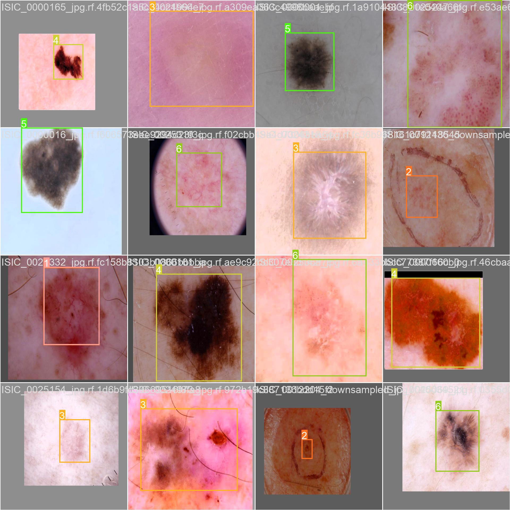
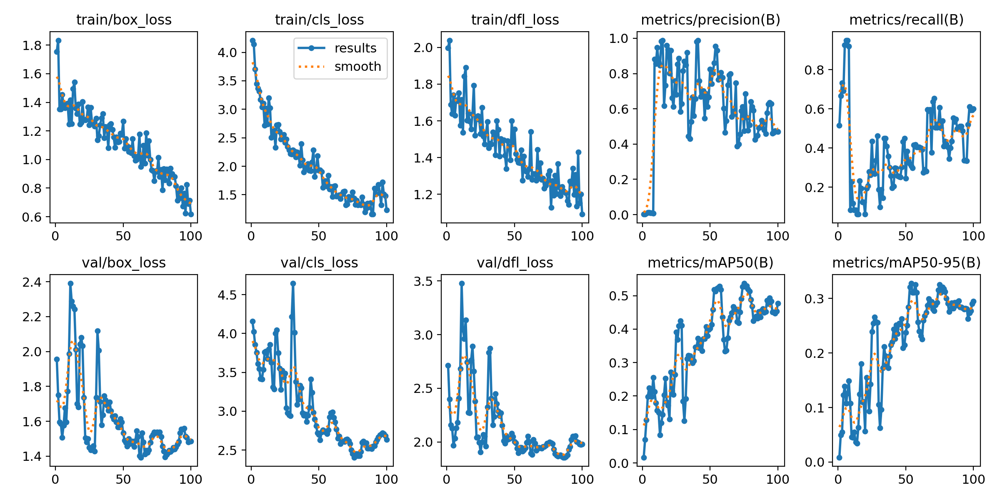

# Official YOLOv7-XAI

Implementation of paper will be shared once the published work is available in online

## Class details can be found in data.yaml file
#Results -Training-batch


[](https://paperswithcode.com/sota/real-time-object-detection-on-coco?p=YOLOv7-XAI-trainable-bag-of-freebies-sets-new)
[](https://huggingface.co/spaces/akhaliq/YOLOv7-XAI)
<a href="https://colab.research.google.com/gist/AlexeyAB/b769f5795e65fdab80086f6cb7940dae/YOLOv7-XAIdetection.ipynb"></a>
[](https://arxiv.org/abs/2207.02696)

<div align="center">
    <a href="./">
        
    </a>
</div>


## Performance 
HAM10000 Dataset

| Model|AK |BCC |BKL |DF| MEL |NV |SCC |VASC|
| :-- | :-: | :-: | :-: | :-: | :-: |:-:| :-: | :-: |
| [**YOLOv7-XAI**](https://github.com/Nirmala-research/YOLOv7-XAI/releases/download/v0.1/YOLOv7-XAI.pt) | **98.9** |**97.4**| **96.5** |**96.7** |**97.4** |**96.0**| **96.4**|**95.0**|
| [**YOLOv7**](https://github.com/WongKinYiu/yolov7) | 95.8| 94.9| 96.0 |94.1| 94.2| 92.3| 95.2| 94.5|
| [**YOLOv6**](https://github.com/meituan/YOLOv6) |94.8| 95.3| 94.4| 93.9 |93.4 |90.8| 94.4| 93.0|




## Installation

Docker environment (recommended)
<details><summary> <b>Expand</b> </summary>

``` shell
# create the docker container, you can change the share memory size if you have more.
nvidia-docker run --name YOLOv7-XAI -it -v your_coco_path/:/coco/ -v your_code_path/:/YOLOv7-XAI --shm-size=64g nvcr.io/nvidia/pytorch:21.08-py3

# apt install required packages
apt update
apt install -y zip htop screen libgl1-mesa-glx

# pip install required packages
pip install seaborn thop

# go to code folder
cd /YOLOv7-XAI
```
</details>

``` shell
python test.py --data data/data.yaml --img 640 --batch 32 --conf 0.001 --iou 0.65 --device 0 --weights YOLOv7-XAI.pt --name YOLOv7-XAI640_val
```


To measure accuracy, download

## Training

Data preparation

labelimg annotation tool

* Download MS HAM10000 dataset images  [HAM10000-annotations for Pycocotools]( https://doi.org/10.7910/DVN/DBW86T) (email:v.nirmalaresearch@gmail.com) for annotated images and label folder sharing

Single GPU training

``` shell
# train p5 models
python train.py --workers 8 --device 0 --batch-size 32 --data data/data.yaml --img 640 640 --cfg cfg/training/YOLOv7-XAI.yaml --weights '' --name YOLOv7-XAI --hyp data/hyp.scratch.p5.yaml

# train p6 models
python train_aux.py --workers 8 --device 0 --batch-size 16 --data data/data.yaml --img 1280 1280 --cfg cfg/training/YOLOv7-XAI-w6.yaml --weights '' --name YOLOv7-XAI-w6 --hyp data/hyp.scratch.p6.yaml
```

Multiple GPU training

``` shell
# train p5 models
python -m torch.distributed.launch --nproc_per_node 4 --master_port 9527 train.py --workers 8 --device 0,1,2,3 --sync-bn --batch-size 128 --data data/data.yaml --img 640 640 --cfg cfg/training/YOLOv7-XAI.yaml --weights '' --name YOLOv7-XAI --hyp data/hyp.scratch.p5.yaml

# train p6 models
python -m torch.distributed.launch --nproc_per_node 8 --master_port 9527 train_aux.py --workers 8 --device 0,1,2,3,4,5,6,7 --sync-bn --batch-size 128 --data data/data.yaml --img 1280 1280 --cfg cfg/training/YOLOv7-XAI-w6.yaml --weights '' --name YOLOv7-XAI-w6 --hyp data/hyp.scratch.p6.yaml
```


## Inference


On image:
``` shell
python detect.py --weights YOLOv7-XAI.pt --conf 0.25 --img-size 640 --source inference/images/horses.jpg
```

<div align="center">
    <a href="./">
        
    </a>
</div>


## Export

**Pytorch to CoreML (and inference on MacOS/iOS)** <a href="https://colab.research.google.com/github/WongKinYiu/YOLOv7-XAI/blob/main/tools/YOLOv7-XAICoreML.ipynb"></a>

**Pytorch to ONNX with NMS (and inference)** <a href="https://colab.research.google.com/github/WongKinYiu/YOLOv7-XAI/blob/main/tools/YOLOv7-XAIonnx.ipynb"></a>
```shell
python export.py --weights YOLOv7-XAI-tiny.pt --grid --end2end --simplify \
        --topk-all 100 --iou-thres 0.65 --conf-thres 0.35 --img-size 640 640 --max-wh 640
```

**Pytorch to TensorRT with NMS (and inference)** <a href="https://colab.research.google.com/github/WongKinYiu/YOLOv7-XAI/blob/main/tools/YOLOv7-XAItrt.ipynb"></a>

```shell
wget https://github.com/Nirmala-research/YOLOv7-XAI/releases/download/v0.1/YOLOv7-XAI-tiny.pt
python export.py --weights ./YOLOv7-XAI-tiny.pt --grid --end2end --simplify --topk-all 100 --iou-thres 0.65 --conf-thres 0.35 --img-size 640 640
git clone https://github.com/Linaom1214/tensorrt-python.git
python ./tensorrt-python/export.py -o YOLOv7-XAI-tiny.onnx -e YOLOv7-XAI-tiny-nms.trt -p fp16
```

**Pytorch to TensorRT another way** <a href="https://colab.research.google.com/gist/AlexeyAB/fcb47ae544cf284eb24d8ad8e880d45c/YOLOv7-XAItrtlinaom.ipynb"></a> <details><summary> <b>Expand</b> </summary>


```shell
wget https://github.com/Nirmala-research/YOLOv7-XAI/releases/download/v0.1/YOLOv7-XAI-tiny.pt
python export.py --weights YOLOv7-XAI-tiny.pt --grid --include-nms
git clone https://github.com/Linaom1214/tensorrt-python.git
python ./tensorrt-python/export.py -o YOLOv7-XAI-tiny.onnx -e YOLOv7-XAI-tiny-nms.trt -p fp16

# Or use trtexec to convert ONNX to TensorRT engine
/usr/src/tensorrt/bin/trtexec --onnx=YOLOv7-XAI-tiny.onnx --saveEngine=YOLOv7-XAI-tiny-nms.trt --fp16
```

</details>

Tested with: Python 3.7.13, Pytorch 1.12.0+cu113


<div align="center">
    <a href="./">
        
    </a>
</div>


## Acknowledgements

<details><summary> <b>Expand</b> </summary>

* [https://github.com/AlexeyAB/darknet](https://github.com/AlexeyAB/darknet)
* [https://github.com/Megvii-BaseDetection/YOLOX](https://github.com/Megvii-BaseDetection/YOLOX)
* [https://github.com/ultralytics/yolov3](https://github.com/ultralytics/yolov3)
* [https://github.com/ultralytics/yolov5](https://github.com/ultralytics/yolov5)
* [https://github.com/DingXiaoH/RepVGG](https://github.com/DingXiaoH/RepVGG)
* [https://github.com/JUGGHM/OREPA_CVPR2022](https://github.com/JUGGHM/OREPA_CVPR2022)
* [https://github.com/TexasInstruments/edgeai-yolov5/tree/yolo-pose](https://github.com/TexasInstruments/edgeai-yolov5/tree/yolo-pose)

</details>
